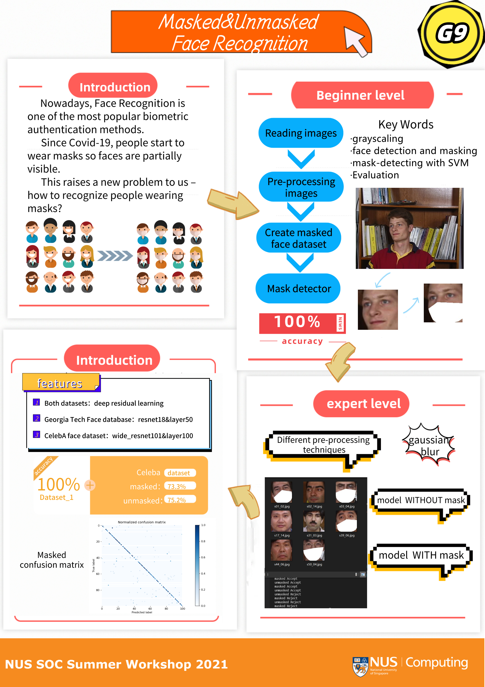
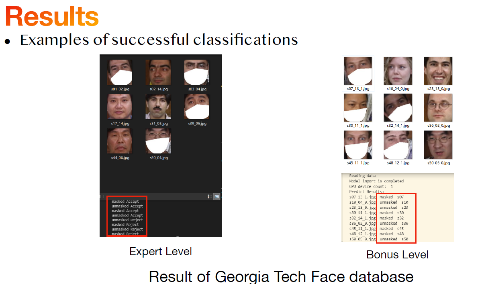
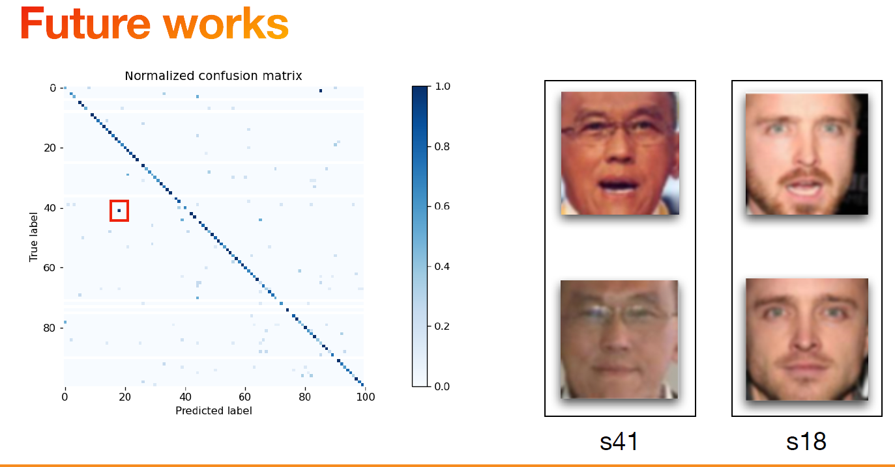

# Masked-Unmasked-Face-Recognition（戴口罩的人脸识别检测）

This is a group project in 2021/7, done while participating the 2021 NUS SWS project as a sophomore. (Cluster: Visual Computing, advisor: Prof. Terence Sim)

The whole project was divided into three parts, including the beginner, expert and bonus level. Detailed requirements can be seen from file 'Requirement of MaskedUnmaskedFaceRecognition.pdf'. All the final results are in folder 'Final Results and Presentation'.

Our group was made up of 4 members. I was the group leader and was responsible for most of the coding work of the whole project.

本项目为2021年7月本人在大二期间参加新加坡国立大学的SWS暑期线上科研项目时完成。项目分支为视觉计算，教授为 Prof. Terence Sim。

整个项目被分为初等、专家与额外三个部分。详细的项目要求可参见Requirement of MaskedUnmaskedFaceRecognition.pdf。项目的所有成果均放置在文件夹Final Results and Presentation中。

项目由四人小组合作完成，在小组内本人（Daniel-ChenJH）担任组长并负责本项目绝大部分代码工作。

# Final Results

本项目目标为完成戴口罩的人脸检测。

CelebA是由香港中文大学开放提供的人脸数据集，包含10,177名人物身份的202,599张人脸图片，每张图片都做好了特征标记，包含人脸bbox标注框、5个人脸特征点坐标以及40个属性标记。

- 对于CelebA数据集，我们首先使用OpenCV、dlib库识别脸部关键点，并给这些人脸加上电子口罩。

- 接下来我们训练了一个支持向量机SVM用于识别图中人脸是否佩戴口罩。我们训练的SVM口罩识别器测试集准确率为100%。

- 我们分别将戴口罩、不戴口罩的人脸图片输入resnet模型进行训练，得到两个识别模型。

- 对于每一组测试人脸，在使用训练好的SVM确认人脸是否戴口罩后，我们将人脸输入对应的、提前训练好的resnet神经网络模型进行推理，由模型给出该人脸的预测标签输出。

- 最终，我们的模型在CelebA数据集上达到了100.0%的口罩佩戴情况识别率、75.2%的不戴口罩身份识别准确率和73.3%的戴口罩身份识别准确率。

